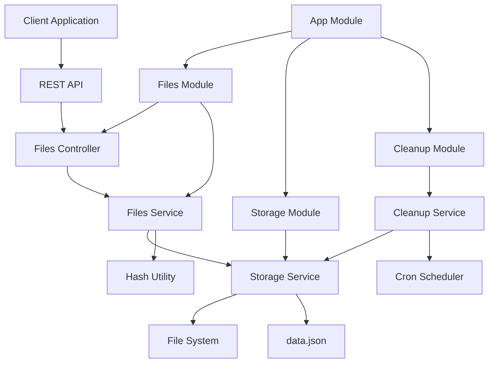

# Архитектура micro-file-cache

## Обзор архитектуры

`micro-file-cache` построен на основе модульной архитектуры с использованием NestJS фреймворка. Сервис разделен на логические модули, каждый из которых отвечает за определенную функциональность.

## Диаграмма компонентов



## Модули системы

### 1. AppModule (Корневой модуль)

**Назначение**: Координирует работу всех модулей приложения.

**Ответственность**:

- Импорт и конфигурация всех модулей
- Настройка глобальных провайдеров
- Конфигурация приложения

**Файлы**:

- `src/app.module.ts`

```typescript
@Module({
  imports: [
    ConfigModule.forRoot({
      isGlobal: true,
      envFilePath: '.env',
    }),
    FilesModule,
    StorageModule,
    CleanupModule,
  ],
  controllers: [],
  providers: [],
})
export class AppModule {}
```

### 2. FilesModule

**Назначение**: Обрабатывает HTTP запросы для работы с файлами.

**Ответственность**:

- Обработка загрузки файлов
- Предоставление информации о файлах
- Удаление файлов
- Валидация входных данных

**Компоненты**:

- `FilesController` - HTTP контроллер
- `FilesService` - бизнес-логика
- DTO классы для валидации

**Файлы**:

- `src/modules/files/files.module.ts`
- `src/modules/files/files.controller.ts`
- `src/modules/files/files.service.ts`
- `src/modules/files/dto/upload-file.dto.ts`
- `src/modules/files/dto/file-response.dto.ts`

### 3. StorageModule

**Назначение**: Управляет файловым хранилищем и метаданными.

**Ответственность**:

- Сохранение и удаление файлов
- Управление метаданными в data.json
- Работа с файловой системой
- Дедупликация файлов

**Компоненты**:

- `StorageService` - сервис для работы с хранилищем

**Файлы**:

- `src/modules/storage/storage.module.ts`
- `src/modules/storage/storage.service.ts`

### 4. CleanupModule

**Назначение**: Автоматическая очистка устаревших файлов.

**Ответственность**:

- Периодическая проверка файлов на истечение TTL
- Удаление устаревших файлов
- Логирование операций очистки

**Компоненты**:

- `CleanupService` - сервис очистки
- Cron job для периодического выполнения

**Файлы**:

- `src/modules/cleanup/cleanup.module.ts`
- `src/modules/cleanup/cleanup.service.ts`

## Сервисы и их ответственность

### FilesService

**Основные методы**:

```typescript
class FilesService {
  // Загрузка файла с дедупликацией
  async uploadFile(file: Express.Multer.File, ttlMinutes: number): Promise<UploadResponse>;

  // Получение информации о файле
  async getFileInfo(id: string): Promise<FileInfo>;

  // Удаление файла
  async deleteFile(id: string): Promise<void>;

  // Проверка существования файла
  async fileExists(id: string): Promise<boolean>;
}
```

**Логика работы**:

1. Валидация входных данных
2. Вычисление хеша файла
3. Проверка на дубликаты
4. Сохранение файла и метаданных
5. Возврат информации о файле

### StorageService

**Основные методы**:

```typescript
import * as fs from 'fs-extra';
import * as path from 'path';
import { fileTypeFromBuffer } from 'file-type';

class StorageService {
  // Сохранение файла с использованием fs-extra
  async saveFile(buffer: Buffer, originalName: string, uuid: string): Promise<string> {
    const date = new Date();
    const year = date.getFullYear();
    const month = String(date.getMonth() + 1).padStart(2, '0');

    // Создание директории в формате YYYY-MM
    const dir = path.join(this.storageDir, `${year}-${month}`);

    // Автоматически создает директории если их нет
    await fs.ensureDir(dir);

    // Создание безопасного имени файла
    const shortName = this.createShortFilename(originalName);
    const extension = path.extname(originalName);
    const filename = `${shortName}-${uuid}${extension}`;

    const filePath = path.join(dir, filename);
    await fs.writeFile(filePath, buffer);

    return path.relative(this.storageDir, filePath);
  }

  // Создание короткого имени файла (до 30 символов)
  private createShortFilename(originalName: string): string {
    const nameWithoutExt = path.parse(originalName).name;

    // Замена неправильных символов на _
    const sanitized = nameWithoutExt.replace(/[^a-zA-Z0-9\-_]/g, '_');

    // Обрезка до 30 символов
    return sanitized.substring(0, 30);
  }

  // Получение файла с проверкой существования
  async getFile(filePath: string): Promise<Buffer> {
    const fullPath = path.join(this.storageDir, filePath);

    // Проверяет существование файла перед чтением
    if (!(await fs.pathExists(fullPath))) {
      throw new NotFoundException('File not found');
    }

    return await fs.readFile(fullPath);
  }

  // Безопасное удаление файла
  async deleteFile(filePath: string): Promise<void> {
    const fullPath = path.join(this.storageDir, filePath);

    // Безопасное удаление - не выбросит ошибку если файл не существует
    await fs.remove(fullPath);
  }

  // Определение MIME типа по содержимому файла
  async getFileMimeType(buffer: Buffer): Promise<string> {
    const type = await fileTypeFromBuffer(buffer);
    return type?.mime || 'application/octet-stream';
  }

  // Сохранение метаданных
  async saveMetadata(fileInfo: FileInfo): Promise<void>;

  // Получение метаданных
  async getMetadata(id: string): Promise<FileInfo | null>;

  // Получение всех метаданных
  async getAllMetadata(): Promise<Record<string, FileInfo>>;

  // Удаление метаданных
  async deleteMetadata(id: string): Promise<void>;
}
```

**Особенности**:

- Атомарные операции с файлами и метаданными
- Обработка ошибок файловой системы
- Оптимизированное чтение/запись data.json
- Использование `fs-extra` для упрощения работы с файловой системой
- Безопасное определение MIME типа с помощью `file-type`

### CleanupService

**Основные методы**:

```typescript
import dayjs from 'dayjs';
import utc from 'dayjs/plugin/utc';

dayjs.extend(utc);

class CleanupService {
  // Запуск очистки
  async runCleanup(): Promise<CleanupResult> {
    const startTime = dayjs().utc();
    const expiredFiles = await this.findExpiredFiles();
    const deletedCount = await this.removeExpiredFiles(expiredFiles);

    const endTime = dayjs().utc();
    const duration = endTime.diff(startTime, 'millisecond');

    this.logger.log(`Cleanup completed: ${deletedCount} files deleted in ${duration}ms`);

    return {
      deletedCount,
      duration,
      lastRun: startTime.toISOString(),
      nextRun: dayjs().add(1, 'minute').utc().toISOString(),
    };
  }

  // Проверка файла на истечение с использованием dayjs
  private isFileExpired(fileInfo: FileInfo): boolean {
    const now = dayjs().utc();
    const expiration = dayjs(fileInfo.expiresAt).utc();

    return now.isAfter(expiration);
  }

  // Поиск устаревших файлов
  private async findExpiredFiles(): Promise<FileInfo[]> {
    const allFiles = await this.storageService.getAllMetadata();
    const now = dayjs().utc();

    return Object.values(allFiles).filter((fileInfo) => {
      const expiration = dayjs(fileInfo.expiresAt).utc();
      return now.isAfter(expiration);
    });
  }

  // Удаление устаревших файлов
  private async removeExpiredFiles(expiredFiles: FileInfo[]): Promise<number> {
    let deletedCount = 0;

    for (const fileInfo of expiredFiles) {
      try {
        await this.storageService.deleteFile(fileInfo.path);
        await this.storageService.deleteMetadata(fileInfo.id);
        deletedCount++;

        this.logger.log(`Deleted expired file: ${fileInfo.originalName} (${fileInfo.id})`);
      } catch (error) {
        this.logger.error(`Failed to delete file ${fileInfo.id}: ${error.message}`);
      }
    }

    return deletedCount;
  }
}
```

**Cron Job**:

```typescript
@Cron('0 * * * * *') // Каждую минуту
async handleCleanup() {
  await this.runCleanup();
}
```

## Механизм дедупликации

### Алгоритм хеширования

```typescript
import { createHash } from 'crypto';

function calculateFileHash(buffer: Buffer): string {
  return createHash('sha256').update(buffer).digest('hex');
}
```

### Процесс дедупликации

1. **Вычисление хеша**: SHA-256 хеш от содержимого файла
2. **Поиск дубликатов**: Проверка существования файла с таким хешем
3. **Обработка результата**:
   - Если дубликат найден: обновление TTL существующего файла
   - Если файл новый: сохранение с новым UUID

### Структура хранения

```
storage/
├── 2024-01/
│   ├── document-pdf-uuid-1.pdf
│   ├── image-jpg-uuid-2.jpg
│   └── text-file-uuid-3.txt
├── 2024-02/
│   └── another-file-uuid-4.docx
└── data.json
```

**Формат именования файлов**: `<SHORT_FILENAME>-<UUID>.<EXT>`

- `SHORT_FILENAME` - обрезанное до 30 символов оригинальное имя файла с заменой неправильных символов на `_`
- `UUID` - уникальный идентификатор файла
- `EXT` - оригинальное расширение файла

**Примеры именования**:

- `very-long-document-name-that-exceeds-30-chars-uuid-123.pdf`
- `my_file_with_spaces-uuid-456.jpg`
- `special@chars#file-uuid-789.txt`

## Система очистки

### Механизм работы

1. **Периодический запуск**: Каждую минуту через cron job
2. **Сканирование метаданных**: Чтение data.json
3. **Фильтрация устаревших**: Поиск файлов с `expiresAt < currentTime`
4. **Удаление файлов**: Физическое удаление из файловой системы
5. **Обновление метаданных**: Удаление записей из data.json
6. **Логирование**: Запись результатов операции

### Оптимизации

- **Батчевая обработка**: Удаление файлов группами
- **Транзакционность**: Атомарные операции с метаданными
- **Обработка ошибок**: Продолжение работы при ошибках отдельных файлов

## Обработка ошибок

### Типы ошибок

1. **Валидационные ошибки**:
   - Некорректный размер файла
   - Неподдерживаемый MIME тип
   - Некорректный TTL

2. **Ошибки файловой системы**:
   - Недостаток места на диске
   - Ошибки чтения/записи
   - Отсутствие директорий

3. **Ошибки приложения**:
   - Повреждение data.json
   - Ошибки хеширования
   - Таймауты операций

### Стратегия обработки

```typescript
// Пример обработки ошибок в FilesService
async uploadFile(file: Express.Multer.File, ttlMinutes: number) {
  try {
    // Валидация
    this.validateFile(file);
    this.validateTTL(ttlMinutes);

    // Обработка
    const result = await this.processFile(file, ttlMinutes);
    return result;

  } catch (error) {
    if (error instanceof ValidationError) {
      throw new BadRequestException(error.message);
    }

    if (error instanceof FileSystemError) {
      throw new InternalServerErrorException('File system error');
    }

    throw new InternalServerErrorException('Upload failed');
  }
}
```

## Конфигурация

### Переменные окружения

```typescript
interface AppConfig {
  listenHost: string;
  listenPort: number;
  authEnabled: boolean;
  authSecretKey?: string;
  storagePath: string;
  maxFileSizeMB: number;
  allowedMimeTypes: string[];
  enableDeduplication: boolean;
  dateFormat: string;
  minTtlMinutes: number;
  maxTtlMinutes: number;
  maxFilesCount: number;
  maxStorageSizeMB: number;
  cleanupCron: string;
  apiBasePath: string;
  apiVersion: string;
  logLevel: string;
  corsOrigin: boolean;
}
```

### Конфигурационный сервис

```typescript
@Injectable()
export class ConfigService {
  get listenHost(): string {
    return process.env.LISTEN_HOST || 'localhost';
  }

  get listenPort(): number {
    return parseInt(process.env.LISTEN_PORT || '3000', 10);
  }

  get authEnabled(): boolean {
    return process.env.AUTH_ENABLED === 'true';
  }

  get authSecretKey(): string | undefined {
    return process.env.AUTH_TOKEN;
  }

  get storagePath(): string {
    return process.env.STORAGE_DIR || '../test-data/micro-file-cache/storage';
  }

  get maxFileSizeMB(): number {
    return parseInt(process.env.MAX_FILE_SIZE_MB || '100', 10); // 100MB
  }

  get allowedMimeTypes(): string[] {
    const types = process.env.ALLOWED_MIME_TYPES;
    return types ? JSON.parse(types) : [];
  }

  get enableDeduplication(): boolean {
    return process.env.ENABLE_DEDUPLICATION !== 'false';
  }


  get minTtlMinutes(): number {
    return parseInt(process.env.TTL_MIN || '10080', 10); // 7 дней
  }

  get maxTtlMinutes(): number {
    return parseInt(process.env.MAX_TTL_MIN || '10080', 10); // 7 дней
  }

  get maxFilesCount(): number {
    return parseInt(process.env.MAX_FILES_COUNT || '10000', 10);
  }

  get maxStorageSizeMB(): number {
    return parseInt(process.env.MAX_STORAGE_SIZE_MB || '1000', 10);
  }

  get cleanupCron(): string {
    return process.env.CLEANUP_CRON || '0 */10 * * * *'; // Cron выражение для очистки
  }

  get apiBasePath(): string {
    return process.env.API_BASE_PATH || 'api';
  }

  get apiVersion(): string {
    return process.env.API_VERSION || 'v1';
  }

  get logLevel(): string {
    return process.env.LOG_LEVEL || 'info';
  }

  get corsOrigin(): boolean {
    return process.env.CORS_ORIGIN !== 'false';
  }
}
```

## Производительность

### Оптимизации

1. **Стриминг файлов**: Использование потоков для больших файлов
2. **Кэширование метаданных**: Кэш в памяти для часто запрашиваемых файлов
3. **Батчевые операции**: Группировка операций с файловой системой
4. **Асинхронная обработка**: Неблокирующие операции

### Мониторинг

```typescript
// Метрики производительности
interface PerformanceMetrics {
  uploadTime: number;
  downloadTime: number;
  cleanupTime: number;
  totalFiles: number;
  totalSize: number;
  averageFileSize: number;
}
```

## Безопасность

### Меры безопасности

1. **Аутентификация**:
   - Bearer токен аутентификация
   - Валидация токенов на всех защищенных endpoints
   - Защита всех API endpoints (кроме /api/v1/health)

2. **Валидация файлов**:
   - Ограничение размера файлов
   - Проверка расширений

3. **Безопасные имена файлов**:
   - Использование UUID вместо оригинальных имен
   - Санитизация путей
   - Предотвращение path traversal

4. **Ограничения ресурсов**:
   - Лимиты на размер файлов
   - Ограничение количества файлов
   - Таймауты операций

### Примеры уязвимостей и защита

```typescript
// Защита от path traversal
function sanitizePath(path: string): string {
  return path.replace(/\.\./g, '').replace(/\/+/g, '/');
}

// Валидация TTL
function validateTTL(ttlMinutes: number, maxTTL: number): boolean {
  return ttlMinutes >= 1 && ttlMinutes <= maxTTL;
}
```

## Масштабируемость

### Горизонтальное масштабирование

1. **Общее хранилище**: NFS или S3 для файлов
2. **Общая база метаданных**: Redis или PostgreSQL
3. **Балансировка нагрузки**: Nginx или HAProxy
4. **Кэширование**: Redis для метаданных

### Вертикальное масштабирование

1. **Увеличение ресурсов**: CPU, RAM, диск
2. **Оптимизация кода**: Профилирование и оптимизация
3. **Настройка Node.js**: Увеличение лимитов памяти

## Тестирование

### Архитектура тестов

Проект использует многоуровневую систему тестирования:

1. **Unit тесты** - тестирование отдельных сервисов и методов
2. **Integration тесты** - тестирование взаимодействия между модулями
3. **E2E тесты** - тестирование полного API с помощью `supertest`

### E2E тестирование с supertest

```typescript
// files.controller.e2e-spec.ts
import { Test, TestingModule } from '@nestjs/testing';
import { INestApplication } from '@nestjs/common';
import * as request from 'supertest';
import { AppModule } from '../src/app.module';

describe('FilesController (e2e)', () => {
  let app: INestApplication;
  const authToken = 'test-token';

  beforeEach(async () => {
    const moduleFixture: TestingModule = await Test.createTestingModule({
      imports: [AppModule],
    }).compile();

    app = moduleFixture.createNestApplication();
    await app.init();
  });

  afterEach(async () => {
    await app.close();
  });

  describe('POST /api/v1/files', () => {
    it('should upload file successfully', () => {
      return request(app.getHttpServer())
        .post('/api/v1/files')
        .set('Authorization', `Bearer ${authToken}`)
        .attach('file', Buffer.from('test content'), 'test.txt')
        .field('ttlMinutes', '60')
        .expect(201)
        .expect((res) => {
          expect(res.body.success).toBe(true);
          expect(res.body.data).toHaveProperty('id');
          expect(res.body.data.originalName).toBe('test.txt');
          expect(res.body.data.ttlMinutes).toBe(60);
        });
    });

    it('should handle file type detection', () => {
      // Создаем PDF файл для тестирования file-type
      const pdfBuffer = Buffer.from('%PDF-1.4\n1 0 obj\n<<\n/Type /Catalog\n>>\nendobj');

      return request(app.getHttpServer())
        .post('/api/v1/files')
        .set('Authorization', `Bearer ${authToken}`)
        .attach('file', pdfBuffer, 'document.pdf')
        .field('ttlMinutes', '60')
        .expect(201)
        .expect((res) => {
          expect(res.body.data.mimeType).toBe('application/pdf');
        });
    });
  });

  describe('GET /api/v1/files/:id/download', () => {
    it('should download file with correct headers', () => {
      return request(app.getHttpServer())
        .get(`/api/v1/files/${fileId}/download`)
        .set('Authorization', `Bearer ${authToken}`)
        .expect(200)
        .expect('Content-Type', /text\/plain/)
        .expect('Content-Disposition', /attachment/)
        .expect((res) => {
          expect(res.text).toBe('test download content');
        });
    });
  });
});
```

### Тестирование с использованием dayjs

```typescript
// cleanup.service.spec.ts
import dayjs from 'dayjs';
import utc from 'dayjs/plugin/utc';

dayjs.extend(utc);

describe('CleanupService', () => {
  let service: CleanupService;

  it('should correctly identify expired files', () => {
    const now = dayjs().utc();
    const expiredFile: FileInfo = {
      id: 'test-id',
      originalName: 'test.txt',
      expiresAt: now.subtract(1, 'minute').toISOString(), // Истек минуту назад
      // ... остальные поля
    };

    const isExpired = service.isFileExpired(expiredFile);
    expect(isExpired).toBe(true);
  });

  it('should not mark non-expired files as expired', () => {
    const now = dayjs().utc();
    const validFile: FileInfo = {
      id: 'test-id',
      originalName: 'test.txt',
      expiresAt: now.add(1, 'hour').toISOString(), // Истечет через час
      // ... остальные поля
    };

    const isExpired = service.isFileExpired(validFile);
    expect(isExpired).toBe(false);
  });
});
```

## Логирование и мониторинг

### Структура логов

```typescript
interface LogEntry {
  timestamp: string;
  level: 'info' | 'warn' | 'error';
  message: string;
  context?: any;
  userId?: string;
  requestId?: string;
}
```

### Ключевые события

- Загрузка файлов
- Удаление файлов
- Ошибки операций
- Запуск очистки
- Изменения конфигурации

### Метрики

- Количество загруженных файлов
- Общий размер хранилища
- Время выполнения операций
- Количество ошибок
- Использование ресурсов

## 📚 Дополнительные ресурсы

- **[API Спецификация](api-specification.md)** - полное описание REST API
- **[Быстрый старт](QUICK_START.md)** - пошаговое руководство по установке
- **[Примеры использования](USAGE_EXAMPLES.md)** - подробные примеры на разных языках
- **[Настройка переменных окружения](ENV_SETUP.md)** - конфигурация системы
